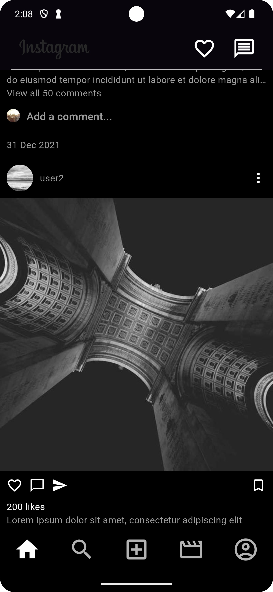

# instagram_clone

A Instagram Feed Clone

## Summary

This is a Instagram Feed Clone using Flutter, it would only implement the feed page, with a list of
posts, head bar and a bottom navigation bar.
The API can be mocked and it is not need to interact with a real API, and the UI components like
Comments, Likes and Shares do not need to be interactive.

- Use https://picsum.photos/ for images mock in the posts.

### Screenshots

|                Light Mode                |               Dark Mode                |
|:----------------------------------------:|:--------------------------------------:|
|  |  |

## Main Features

- [x] Header Bar
- [x] Bottom Navigation Bar
- [x] Post List
- [x] Post Item
    - [x] Multiple Images Support
- [x] Snap effect on scroll (It is better to remove the PageScrollPhysics to make it more smooth).
- [x] Unit Tests.
- [x] Dart Theme Support
